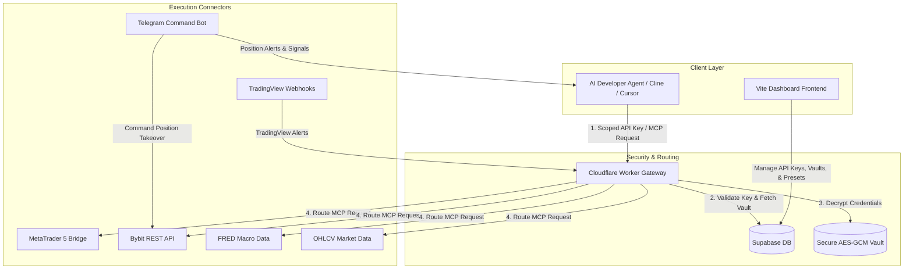

# BastionMCP (Sentinel-MCP) — Secure Broker Gateway & Stateful Trading SaaS

BastionMCP is a enterprise-grade **Secure Broker Gateway** and stateful trading bot system designed to bridge LLM AI Developer Agents (such as Cursor, Cline, and custom LLM scripts) with brokerage accounts and financial exchanges safely, using the **Model Context Protocol (MCP)**.

---

## 🌟 The Problem & The Solution

### 1. The Security Nightmare of Raw Keys
* **The Problem:** Giving an AI coding agent direct access to raw brokerage API keys, MT5 passwords, or secret tokens is highly risky. A single hallucinated command or unvetted package update could result in disastrous unauthorized trades, account liquidation, or credential leaks.
* **The Solution:** BastionMCP acts as a security gateway. Sensitive exchange/broker credentials are encrypted in a **Credentials Vault** using **AES-GCM** before database storage. LLMs communicate with BastionMCP using client-scoped, revocable API keys, preventing raw credentials from ever being exposed in chat history, logs, or prompt contexts.

### 2. Fragmentation of Trading APIs
* **The Problem:** Integrating different exchanges (Bybit), traditional platforms (MetaTrader 5), macroeconomic data sources (FRED), and alert webhooks (TradingView) requires writing custom integration logic for each platform.
* **The Solution:** BastionMCP standardizes these fragmented protocols under the **Model Context Protocol (MCP)**. Any AI agent supporting MCP can seamlessly discover, query, and interact with these connectors via unified tools.

### 3. Stateful & Non-Simultaneous Position Management
* **The Problem:** Standard trading webhooks execute instantaneous "blind" orders. They cannot handle complex, multi-timeframe state transitions or manage existing open positions without active supervision.
* **The Solution:** BastionMCP features a **Stateful Trading Bot** that manages open positions. It processes non-simultaneous trading signals (BIAS on 30m/15m -> SETUP on 5m -> ENTRY on 1m) and takes over active trades, executing user-defined preset strategies (Fixed Take Profit, Trailing Stop-Loss, or Contrary Signal Exit) and routing signals to Telegram.

---

## 🏗️ System Architecture

The following diagram illustrates the flow of control and data between the AI Agent, the Gateway, database/vault layers, and the execution connectors.



---

## 📦 Project Workspaces

This repository is organized as a monorepo containing the following components:

| Workspace Path | Description | Tech Stack |
| :--- | :--- | :--- |
| [`/web`](file:///c:/Users/DANIEL/Sentinal-MCP/web) | **Dashboard Frontend:** Responsive interface for managing vaults, generating client API keys, configuring trading bot presets, and viewing audit logs. | Vite, Vanilla JS, CSS Glassmorphism |
| [`/workers/gateway`](file:///c:/Users/DANIEL/Sentinal-MCP/workers/gateway) | **Gateway Router:** API key validator, rate-limiter, and secure router that forwards requests to connectors. | Cloudflare Workers, TypeScript |
| [`/workers/connectors/bybit`](file:///c:/Users/DANIEL/Sentinal-MCP/workers/connectors/bybit) | **Bybit Connector:** MCP server wrapping Bybit futures/spot endpoints for position checking and order routing. | Cloudflare Workers, Bybit API |
| [`/workers/connectors/mt5`](file:///c:/Users/DANIEL/Sentinal-MCP/workers/connectors/mt5) | **MT5 Connector:** Bridges commands to MetaTrader 5 terminals (via HTTP/ZeroMQ). | Cloudflare Workers, ZeroMQ/HTTP |
| [`/workers/connectors/tradingview`](file:///c:/Users/DANIEL/Sentinal-MCP/workers/connectors/tradingview) | **TradingView Connector:** Handlers for parsing incoming webhook alerts from TradingView charts. | Cloudflare Workers |
| [`/workers/connectors/fred`](file:///c:/Users/DANIEL/Sentinal-MCP/workers/connectors/fred) | **FRED Connector:** Macroeconomic indicators tool fetching data from the St. Louis Fed. | Cloudflare Workers |
| [`/workers/connectors/ohlcv`](file:///c:/Users/DANIEL/Sentinal-MCP/workers/connectors/ohlcv) | **Market Data Connector:** Live and historical candlestick aggregator. | Cloudflare Workers |
| [`/workers/telegram-bot`](file:///c:/Users/DANIEL/Sentinal-MCP/workers/telegram-bot) | **Telegram Command Bot:** Allows users to link Telegram chat IDs, configure Take Profit presets, and manage active position takeovers. | Cloudflare Workers, Telegram Bot API |
| [`/workers/stripe-webhook`](file:///c:/Users/DANIEL/Sentinal-MCP/workers/stripe-webhook) | **Billing Webhook:** Handles subscriptions and billing events to automatically adjust user rate limits. | Cloudflare Workers, Stripe |

---

## 🚀 Getting Started

### 1. Local Development

Install monorepo dependencies from the root directory:
```bash
npm install
```

Start the dashboard locally:
```bash
npm run dev:web
```
This starts the Vite dev server for the frontend, which will be accessible at `http://localhost:5173`.

Run the gateway locally:
```bash
npm run dev:gateway
```
This runs the Gateway Worker using Wrangler on port `8787` (`http://localhost:8787`).

### 2. Frontend Hosting (GitHub Pages)

The frontend is a static single-page application that can be hosted entirely for free on GitHub Pages. 

This repository is pre-configured with a GitHub Actions workflow (`.github/workflows/deploy.yml`) that automatically builds and deploys the dashboard.

#### Setup Instructions:
1. Push this repository to your GitHub account: `https://github.com/626gl1ch/sentinal-mcp.git`.
2. On GitHub, navigate to your repository **Settings** -> **Pages**.
3. Under **Build and deployment** -> **Source**, select **GitHub Actions** (instead of "Deploy from a branch").
4. On your next commit (or via a manual trigger in the **Actions** tab), GitHub will run the build and publish the dashboard to:
   `https://626gl1ch.github.io/sentinal-mcp/`

Once opened, you can bind your Supabase URL, Anon Key, and Gateway Worker URL directly through the **Configuration Binding** drawer at the bottom right.
